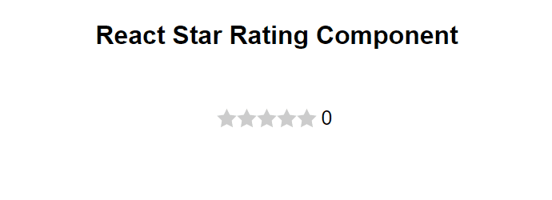

# React Simple Rating

> A simple react component for adding a star rating to your project.

[](https://www.npmjs.com/package/react-simple-star-rating) [](https://standardjs.com)

<p align="center">
  
</p>

## Install

#### npm

```sh
npm i react-simple-star-rating
```

#### Yarn

```sh
yarn add react-simple-star-rating
```

<br />

## Usage

```jsx
import React, { useState } from 'react'
import { Rating } from 'react-simple-star-rating'

export function MyComponent() {
  const [rating, setRating] = useState(0)

  // Catch Rating value
  const handleRating = (rate: number) => {
    setRating(rate)

    // other logic
  }
  // Optinal callback functions
  const onPointerEnter = () => console.log('Enter')
  const onPointerLeave = () => console.log('Leave')
  const onPointerMove = (value: number, index: number) => console.log(value, index)

  return (
    <div className='App'>
      <Rating
        onClick={handleRating}
        onPointerEnter={onPointerEnter}
        onPointerLeave={onPointerLeave}
        onPointerMove={onPointerMove}
        /* Available Props */
      />
    </div>
  )
}
```

## Reset Rating Value

```jsx
import React, { useState } from 'react'
import { Rating } from 'react-simple-star-rating'

export function MyComponent() {
  const [rating, setRating] = useState(0)

  // Catch Rating value
  const handleRating = (rate: number) => {
    setRating(rate)
  }

  const handleReset = () => {
    // Set the initial value
    setRating(0)
  }

  return (
    <div className='App'>
      {/* set initial value */}
      <Rating onClick={handleRating} initialValue={rating} />

      <button onClick={handleReset}>reset</button>
    </div>
  )
}
```

### Available Props

| Prop                 | Type             | Options  | Description                                               |          Default           |
| -------------------- | ---------------- | -------- | --------------------------------------------------------- | :------------------------: |
| `onClick`            | function         | Optional | callback with `hover`, `index` and `event` values passed  |            `-`             |
| `onPointerMove`      | function         | Optional | callback with `hover`, `index` and `event` values passed  |            `-`             |
| `onPointerEnter`     | function         | Optional | callback with `event` passed                              |            `-`             |
| `onPointerLeave`     | function         | Optional | callback with `event` passed                              |            `-`             |
| `initialValue`       | number           | Optional | Set initial value                                         |            `0`             |
| `iconsCount`         | number           | Optional | Number of the icons                                       |            `5`             |
| `readonly`           | boolean          | Optional | Readonly mode                                             |          `false`           |
| `rtl`                | boolean          | Optional | RTL mode                                                  |          `false`           |
| `transition`         | boolean          | Optional | Adds a smooth transition effect on mouse hover            |          `false`           |
| `allowFraction`      | boolean          | Optional | Enable a fractional icon (half icon)                      |          `false`           |
| `className`          | string           | Optional | Applied to the `main` span                                | `react-simple-star-rating` |
| `style`              | CSSProperties    | Optional | Inline style applied to the `main` span                   |       `basic style`        |
| `size`               | number           | Optional | SVG Icon width / height in `px`                           |            `25`            |
| `SVGstrokeColor`     | string           | Optional | SVG Icon stroke color                                     |       `currentColor`       |
| `SVGstorkeWidth`     | string \| number | Optional | SVG Icon storke width                                     |            `0`             |
| `SVGclassName`       | string           | Optional | SVG Icon css class                                        |         `star-svg`         |
| `SVGstyle`           | CSSProperties    | Optional | SVG inline style                                          |            `-`             |
| `fillIcon`           | ReactNode        | Optional | Custom fill icon SVG                                      |           `null`           |
| `fillColor`          | string           | Optional | Fill icons color                                          |         `#f1a545`          |
| `fillColorArray`     | array            | Optional | Array of string to add color range                        |            `[]`            |
| `fillStyle`          | CSSProperties    | Optional | Inline style applied to `filled` icon span                |       `basic style`        |
| `fillClassName`      | string           | Optional | Applied to the `filled` icon span                         |       `filled-icons`       |
| `emptyIcon`          | ReactNode        | Optional | Custom empty icon SVG                                     |           `null`           |
| `emptyColor`         | string           | Optional | Empty icons color                                         |         `#cccccc`          |
| `emptyStyle`         | CSSProperties    | Optional | Inline style applied to `empty` icon span                 |       `basic style`        |
| `emptyClassName`     | string           | Optional | Applied to the `empty` icon span                          |       `empty-icons`        |
| `customIcons`        | array of object  | Optional | Add a group of icons                                      |            `[]`            |
| `allowHover`         | boolean          | Optional | Enable / Disable hover effect                             |           `true`           |
| `disableFillHover`   | boolean          | Optional | Enable / Disable hover effect on filled stars             |          `false`           |
| `showTooltip`        | string           | Optional | Show a tooltip with live values                           |          `false`           |
| `tooltipDefaultText` | string           | Optional | Initial tooltip text if no rating value                   |        `Your Rate`         |
| `tooltipArray`       | array            | Optional | Array of strings to show inside tooltip                   |            `[]`            |
| `tooltipClassName`   | string           | Optional | Tooltip CSS class                                         |      `rating-tooltip`      |
| `tooltipStyle`       | CSSProperties    | Optional | Inline style applied to the `tooltip` span                |       `basic style`        |
| `titleSeparator`     | string           | Optional | Separator word in a title of a rating star `(1 out of 5)` |          `out of`          |

---

<br />

## BREAKING CHANGES: version [4.1.0](https://github.com/awran5/react-simple-star-rating/compare/v4.0.5...v4.1.0) (2022-10-03)

| old             | new             | changes   |
| --------------- | --------------- | --------- |
| `allowHalfIcon` | `allowFraction` | `Renamed` |
| `fullIcon`      | `fillIcon`      | `Renamed` |
| `fullStyle`     | `fillStyle`     | `Renamed` |
| `fullClassName` | `fillClassName` | `Renamed` |
| `ratingValue`   | `-`             | `Removed` |

## Demos

See all demos and usage examples [in action](https://react-simple-star-rating.vercel.app/).

<br />

[](https://codesandbox.io/s/react-simple-rating-ts-fzmpu?fontsize=14&hidenavigation=1&theme=dark)

### License

MIT © [awran5](https://github.com/awran5/)
